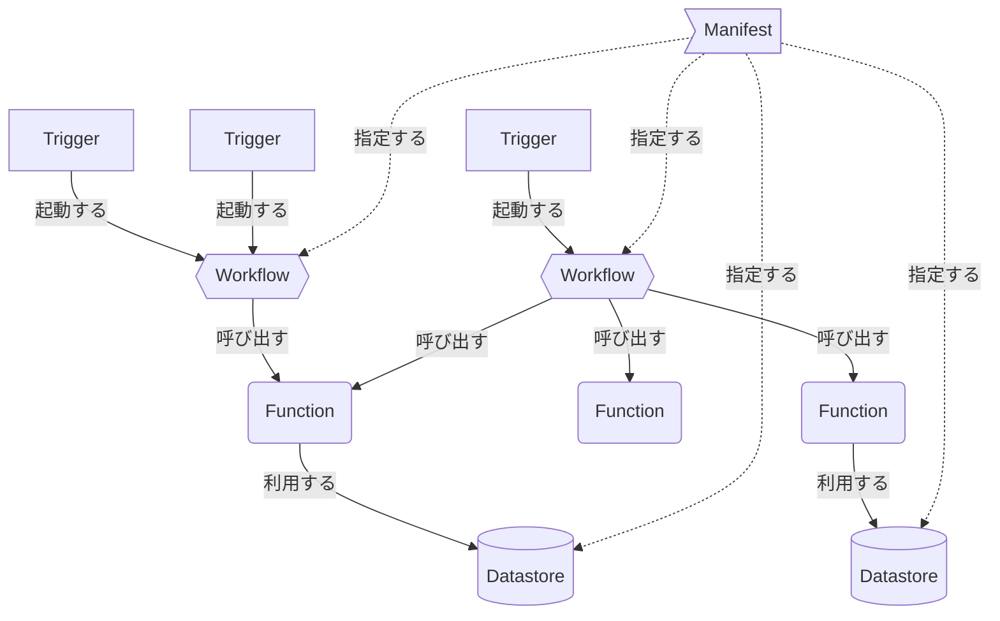

# Slack App 開発環境（new Slack platform）

このリポジトリは、 new Slack platform を利用して Slack App を開発するためのものです。  
new Slack platform については[こちら](https://api.slack.com/future)を参照してください。

⚠️ このリポジトリを使用する際は、まず `template-slack-app` という文字列を各プロジェクトに適した名前に一括置換してください。

## 前提

この開発環境は以下の環境を前提としています。

- WSL2
- Docker
- VS Code

## 開発環境の構築

⚠️ `git clone` を実行する際は、 WSL 上で実行してください。

WSL 上で VS Code を開くと右下からポップアップが表示されるので、 `Reopen in Container` をクリックしてしばらくお待ちください。  
もし表示されなかったり消えてしまったりしたら、コマンドパレットから `Dev Containers: Reopen in Container` を実行してしばらくお待ちください。

### `shared_dot_slack` ボリュームについて

コンテナのリビルドに合わせて認証情報が消去されないようにするために、 `shared_dot_slack` という名前の Docker ボリュームに `.slack` が永続化されています。  
このボリュームはプロジェクトごとに一意になるように設定されていません。  
もし、プロジェクトごとに異なる認証情報が必要になる場合には、 `.env` に記載してある `DOT_SLACK_VOLUME_NAME` にプロジェクトを識別できる名前を指定してください。

## クイックスタート

公式ドキュメントの [Step 2](https://api.slack.com/future/quickstart#authorize-cli) から実行してください。

### 補足

`slack create` コマンドを使用して作成したコードを修正する際は、 `code <your-app-name>` を実行して対象のディレクトリを開き直してください。  
`slack` コマンドは開き直したエディタ上でも利用できます。

## 概要図

